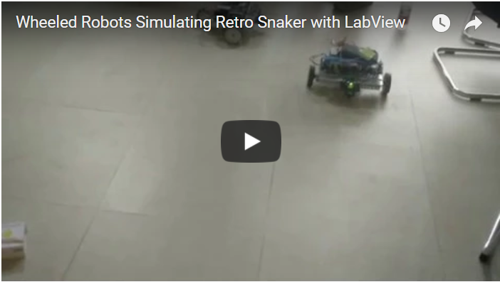
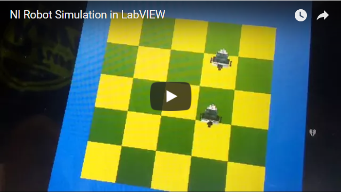

# General Descriptions #

In 2016, I undertook the project, Robot Indoor Self-localization and Multi-robot Communication, aiming to make two wheeled robots imitate the ¡°Retro Snaker¡± game based on LabVIEW and NI robot. The main problem was how to realize the mutual cooperation and communication among robots.

# Main Contribution #
* Applied NI Labview software to control the robot real-time via Wireless Local Area Networks;
* Improved the kinematic mathematical model of robot and applied it to robot self-localization;
* Implemented artificial potential field method and A* planner on the DaNI robot to acquire ideal path and to navigate;

# Results #

## Real robots' result of the¡°Retro Snaker¡± ##

## Simulation results ##

